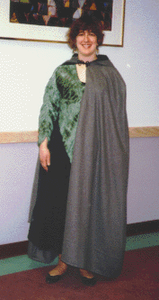

Despite what they run at RenFairs, you can make an attractive, servicable wool cloak for under $100, and in about 2 or 3 days time. Even the novice sewer can pull this off (trust me!). I've done about six, now, both with and without patterns.

The most difficult part of making a cloak is cutting your fabric. Cutting five+ yards of fabric takes up a lot of space, and a fair amount of time. If you have a large table, all the better, otherwise a nice clean floor will do the trick.

As far as constrcution is concerned, the attachment of the hood is the hardest part (at least in my opinion).

**Material**

You can use a variety of fabrics for your cloak, depending on what you intent for its function, your budget, etc.
* +Wool+ - my favorite. You can use either 100% wool, or a wool/polyester blend. Prices can range from $6 - $13 /yard, depending on the style and quality of the fabric. I've discovered that if you check the bargain fabric selections of stores such as Joanne Fabrics, you can find it for as cheap at $3/yard. Minnesota fabrics has also been known to have wool coating remnants in the $7/yard range. Remember to ask the sales staff about pre-washing your wool!

As for lining (and I HIGHLY recommend lining your cloak) I have used both satin and cotton blends. I find the cotton is far more durable and easy to work with, and, for summer fairs, far more comfortable.

* +Velvet+ - Velvet cloaks look very cool. But remember, quality velvet is expensive - in excess of $10/yard! Also, I recommend velvet only for experienced sewers, as there are a number of difficulties in using the fabric. If you decide to go with velvet and have never sewn with it, I recommend asking the fabric store's sales staff for advice, or picking up a fabric guide. Any beginning sewing books will have sections on working with a variety of fabrics.

* +Cotton blends+ - A heavyweight cotton blend can also work for cloak material, and is probably the cheapest option.

**Notions**

The primary notion associated with cloaks is the clasp. There's a wide variety out there. One of the simplest and cheapest options is a frog.

**Patterns** - I've found these modern patterns to work very well for cloaks.

+Simplicity+

* 9229 - This costume pattern has a good cloak.

+McCall's+

* 6775 - Another costume pattern with a nice cloak

+Vogue+

* 7110 - One of my favorite cloak patterns. I've used this one twice, and have been very pleased with the results. Jill's cloak, pictured right, is an example of the Vogue 7110 pattern. Like almost all the cloaks I do, it's a poly/wool blend, lined with broadcloth. Simple, wears well, and fairly inexpensive.