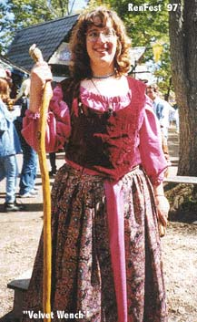

I've discovered that some of the recent costume patterns put out have been fairly nice, and at least make a good guide to make garb even if they aren't always quite 'period'.

**Material**

These patterns can be used with a wide variety of fabrics, depending on how fancy you want your garb, and/or how much you're willing to spend. Again, check out the bargain fabrics section of your local fabric store. I've found gems like 6 yards of sea green bridal satin for $0.88 a yard before...

I've found that for most **chemises, underdresses, blouses and men's shirts and breeches**, cottons and broadcloths are your best bet. They're inexpensive, lightweight and comfortable, come in a great variety of colors, wash well, and wear quite durably. You can use satin and taffeta, but they are much more expensive, and while they look beautiful are much harder to maintain, and tend not to breathe as well. If you're planning to use your garb for Faire or LARP, I would recommend against these fabrics unless it's a special occasion costume.

There is a wide variety of fabrics you can use for **overdresses, bodices and men's tunics**. Many of your upholstery fabrics (brocades, velvets etc.) work wonderfully. They are nicely weighted, and can have beautiful, rich colors and prints. I also discovered that a lightweight corderoy works very well for LARP and Faire garb. Always remember to check your bargain section of your local fabric store!

**Notions**

I tend to use very basic notions. Since I don't do this for authenticity's sake, I use zippers, hook and eyes, and grommets for fastenings.

Zippers and hook and eyes are fairly self-explanatory. Follow the directions on your pattern.

As for grommets, which I use quite often, you want to use the larger, sturdier kind. The small ones, which you can attach with the special pliers, are a pain in the arse when working with the heavy fabrics used in garb making. When using grommets, you want to reinforce the section of fabric you will be placing them in. I recommend using a heavier-weight interfacing. Aslo, when inserting the grommets, don't attempt to cut a circle to place the stem in. Make a small X at the proper place with a sharp Xacto knife or equivalent.

**Patterns**

While I usually prefer Simplicity, McCalls does have some great fantasy costume patterns.

[Simplicity](http://www.simplicity.com/)

* [7756](7756.jpg) - I just did a version of the more elaborate dress in this pattern, minus the sleeves, and with McCall's 8826, a nice kirtle, for the underdress. I also modified the bodice, lacing it up the sides as well as the front, and paneling the overskirt. Pictures soon!
* [8286](8286.jpg) (was 9229) - Great jester garb, and garb for nobility types (male and female)
* 9982 - View 5

McCall's

* 6775 - "Medieval Magic" The picture to the left is the adult woman's outfit in this pattern. I used some upholstery velvet for the bodice, and instead of the hook and eye take for a closure, used grommets and laced it up the back. A nice calico for the overskirt, and a broadcloath for the underdress. The model is my friend Jill, for whom I did the outfit in Fall, '97.
* 6720- "Magestic Knights" (men's garb)
* 8449 - (women's)
* 8450 - (men's)
* 6810 - View C
* P314 - great for little kids