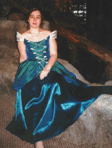

# Gowns

Everyone needs a good, fancy ball gown in their wardrobe...

**Material**

Well, if you're going for snazzy, then go for the specialty fabrics: satin, brocade, taffeta, silk...

Now, if you've never worked with the above fabrics, then practice with some small pieces. Satin, whole gorgeous to look at, is a pain in the hiney to sew. Brocade isn't bad, but you have a similar problem to satin with taffeta and silk.

**Notions**

**Patterns**

Simplicity

7469 - This is actually a bridal gown pattern, but if you use the view with the front lacing, it makes a nice fantasy gown. I did a version of it for AmberCon 8 (pictured right), and it turned out wonderfully. The bodice is of a heavy irridescent nylon, and the skirt is of teal bridal satin. The hip drapes (also of the nylon) were not part of the original pattern.